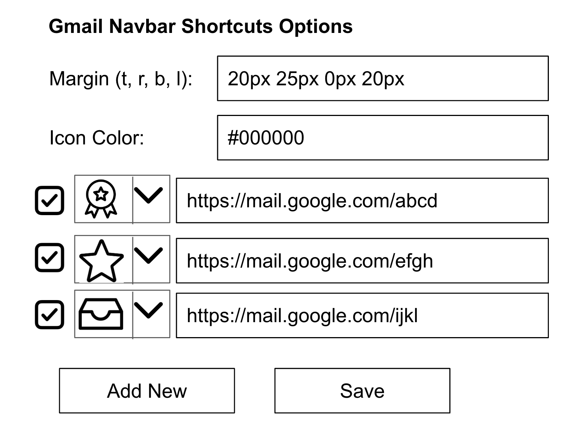

# Gmail shortcuts in left navbar

Adds shortcuts to gmail's left nav bar.

# Status

Hard coded to suit my immediate needs.

# Todo

- add an options page to customize links and icons

If you want to contribute, this is what I plan to have in the options page. There are a few pre-selected icons in the svgs folder that the user can choose from. Default options for inbox, starred, sent, trash, and all will pre-exist.

# Manually loading the extension

This is not on the chrome webstore yet. So you'll have to load it manually.

- First you have to download the code in this repo:
  - If you have git, then: git clone https://github.com/sathishvj/gmail-navbar-shortcuts-chrome-extension
  - If you don't have git, then: find the "Code" button on the repo landing page, click the arrow next to it, then "Download ZIP", and the extract the zip file.
- On Chrome browser, in the address bar enter chrome://extensions.
- On the top left, there should be a button named "Load unpacked".
- Choose the directory where this extension code (manifest.json and .js files) has been downloaded.
