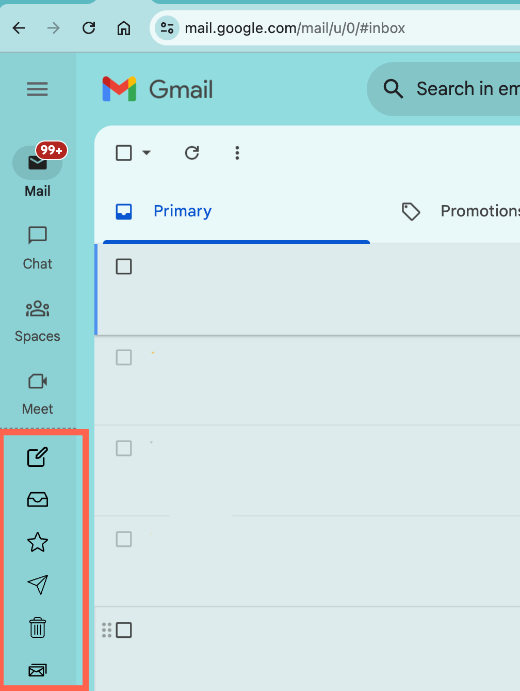
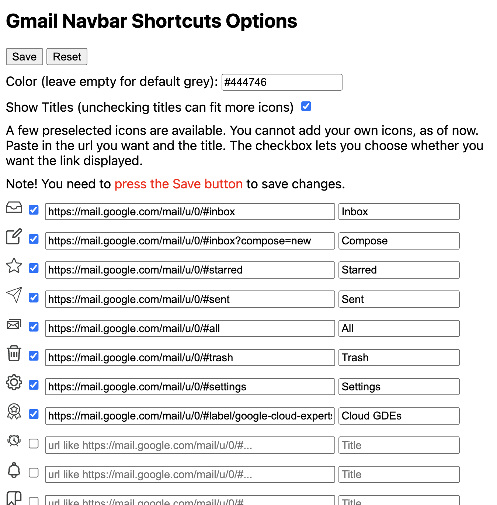

# Gmail Navbar Shortcuts

Adds shortcuts to Gmail's left nav bar. Customize the links to your needs.

# Todos and Ideas

If you can contribute, here are some ideas:

- Detect url and highlight specific shortcut icon.
- Detect changes in options and prompt to save.
- Enable Save button in Options only if there are changes.
- Rename "Reset" button to "Fill with Defaults".
- Export and import configuration.

# Manually loading the extension

To contribute, you can manually install it and work on it.

- First you have to download the code in this repo:
  - If you have git, then: git clone https://github.com/sathishvj/gmail-navbar-shortcuts-chrome-extension
  - If you don't have git, then: find the "Code" button on the repo landing page, click the arrow next to it, then "Download ZIP", and the extract the zip file.
- On Chrome browser, in the address bar enter chrome://extensions.
- On the top left, there should be a button named "Load unpacked".
- Choose the directory where this extension code (manifest.json and .js files) has been downloaded.
